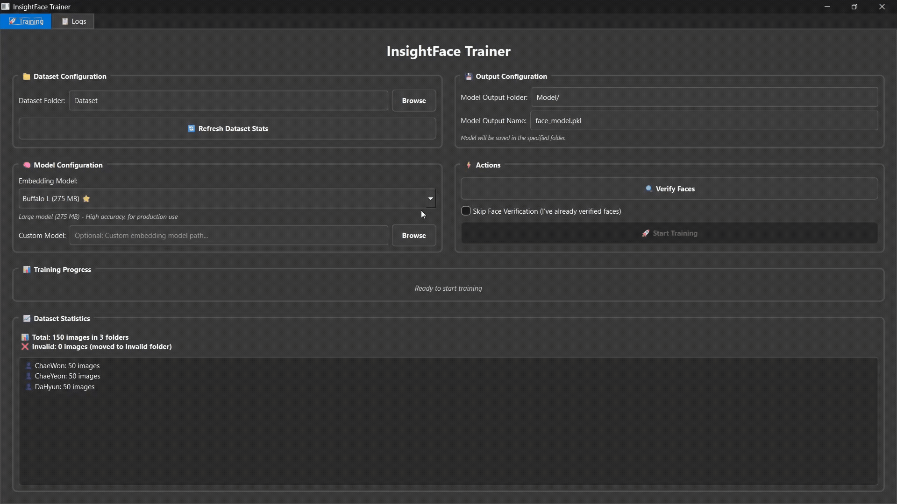

# 🤖 InsightFace Trainer

[](https://www.python.org/)
[](https://doc.qt.io/qtforpython/)
[](https://github.com/deepinsight/insightface)
[](https://scikit-learn.org/)

GUI application for training face recognition models using [InsightFace](https://github.com/deepinsight/insightface) embeddings and SVM classifier. Features automatic face verification, and real-time training progress.



## ✨ Features

🔍 **Automatic Face Verification** - Validates dataset images for single face detection  
🧠 **Multiple Embedding Models** - Support for Buffalo L/S/SC and Antelope V2 models  
🎯 **SVM Classification** - High-performance linear SVM for face recognition  
📄 **JSON Metadata Export** - Training information saved for future reference  

## 🚀 Quick Start

### Prerequisites

- Python 3.8 or higher
- CUDA-compatible GPU (recommended) or CPU

### Installation

1. **Clone the repository**
   ```bash
   git clone https://github.com/AldyRevigustian/InsightFace-Trainer.git
   cd InsightFace-Trainer
   ```

2. **Install dependencies**
   ```bash
   pip install -r requirements.txt
   ```

3. **Run the application**
   ```bash
   python main.py
   ```

## 📁 Dataset Structure

Organize your dataset in the following folder structure:

```
InsightFace-Trainer/
└── Dataset/
    ├── Person_1/
    │   ├── image1.jpg
    │   ├── image2.png
    │   └── image3.jpeg
    ├── Person_2/
    │   ├── photo1.jpg
    │   └── photo2.png
    └── Person_N/
        ├── face1.jpg
        └── face2.jpg

```

### 📋 Dataset Guidelines

- **Folder Names**: Use person names or IDs as folder names
- **Image Formats**: Supports JPG, JPEG, PNG, BMP, TIFF, WEBP, AVIF
- **Image Quality**: Use clear, well-lit face images
- **Face Count**: Each image should contain exactly one face
- **Image Size**: No strict requirements, but 224x224 or higher recommended

#### 📊 Recommended Images Per Person

| Images Count | Accuracy | Training Time | Use Case |
|-------------|----------|---------------|----------|
| 10-100 | Good | Fast | Testing/Development |
| 100-300 | High | Medium | Production Use |
| 300-1000 | Very High | Slow | High Accuracy Required |
| 1000+ | Excellent | Very Slow | Research/Critical Applications |

### 🗂️ Example

For reference, you can check out this example dataset:
- **tripleS Member Dataset**: [Kaggle Dataset](https://www.kaggle.com/datasets/aldeyyyyy/triples-member) - tripleS Member face dataset
- **tripleS Member Recognition**: [HuggingFace Model](https://huggingface.co/Aldey/tripleS-Member-Recognition) - Trained to classify tripleS members using using this application

### ⚠️ Invalid Images

Images will be automatically moved to the `Invalid` folder if they:
- **No face detected**: Image doesn't contain any recognizable face
- **Multiple faces detected**: Image contains more than one face
- **Corrupted files**: Unable to load or process the image
- **Poor quality**: Face is too blurry, dark, or unclear for detection

## 📖 How to Use

### Step 1: Prepare Your Dataset
1. Create a `Dataset` folder
2. Create subfolders for each person
3. Add face images to respective person folders

### Step 2: Configure Settings
1. **Dataset Folder**: Browse and select your dataset directory
2. **Embedding Model**: Choose from available InsightFace models:
   - **Buffalo L** ⭐ (275 MB) - Recommended for production
   - **Buffalo S** (122 MB) - Faster processing
   - **Buffalo SC** (14.3 MB) - Lightest option
   - **Antelope V2** (344 MB) - Best performance
3. **Output Settings**: Set model output folder and filename

### Step 3: Verify Faces
1. Click **"🔍 Verify Faces"** to validate your dataset
2. The application will:
   - Check each image for face detection
   - Move invalid images to `Invalid` folder (no face or multiple faces detected)
   - Provide detailed verification results
   - Update dataset statistics
3. **Important**: Only images with exactly one face will be used for training

### Step 4: Train Model
1. After successful verification, click **"🚀 Start Training"**
2. Monitor real-time progress in the Training Progress section
3. View detailed logs in the Logs tab

### Step 5: Use Your Model
- Trained model: `Model/face_model.pkl`
- Training info: `Model/face_model_names.json`
- Invalid images: `Invalid/` folder for review

## ⚙️ Configuration Options

### Embedding Models Comparison

| Model | Size | Speed | Accuracy | Use Case |
|-------|------|-------|----------|----------|
| Buffalo L ⭐ | 275 MB | Medium | High | Production |
| Buffalo S | 122 MB | Fast | Good | Real-time apps |
| Buffalo SC | 14.3 MB | Very Fast | Basic | Resource-limited |
| Antelope V2 | 344 MB | Slow | Highest | Research/Quality |

### Advanced Options

- **Skip Verification**: Use if you've already verified your dataset
- **Custom Model Path**: Load your own embedding model
- **Output Folder**: Customize where models are saved
- **GPU/CPU Selection**: Automatic detection with fallback

### Performance Tips

- **GPU Usage**: Ensure CUDA is properly installed for faster processing
- **Memory**: Close other applications during training
- **Dataset Size**: Start with smaller datasets for testing
- **Image Quality**: Use high-quality, well-lit face images
- **Optimal Dataset**: 15-30 images per person gives best accuracy vs training time balance
- **Face Position**: Center the face in the image for better detection
- **Lighting**: Ensure good, even lighting across the face

## 📊 Output Files

### Generated Files

1. **`face_model.pkl`** - Trained SVM classifier with label encoder
2. **`face_model_names.json`** - Training metadata including:
   ```json
   {
     "model_file": "face_model.pkl",
     "training_date": "2025-01-15 14:30:25",
     "total_persons": 4,
     "total_samples": 156,
     "person_names": ["Person_1", "Person_2", "Person_3", "Person_4"],
     "embedding_model": "buffalo_l",
     "dataset_path": "Dataset"
   }
   ```

### Using Trained Models

Load and use your trained model:

```python
import joblib
import json

# Load model
svm_classifier, label_encoder = joblib.load('Model/face_model.pkl')

# Load training info
with open('Model/face_model_names.json', 'r') as f:
    training_info = json.load(f)

print(f"Model trained on {training_info['total_persons']} persons")
print(f"Person names: {training_info['person_names']}")
```

## 📚 Related Resources

- **InsightFace Repository**: [https://github.com/deepinsight/insightface](https://github.com/deepinsight/insightface)
- **Example Dataset**: [tripleS Member Dataset on Kaggle](https://www.kaggle.com/datasets/aldeyyyyy/triples-member)
- **Pre-trained Model**: [tripleS Member Recognition on HuggingFace](https://huggingface.co/Aldey/tripleS-Member-Recognition)
